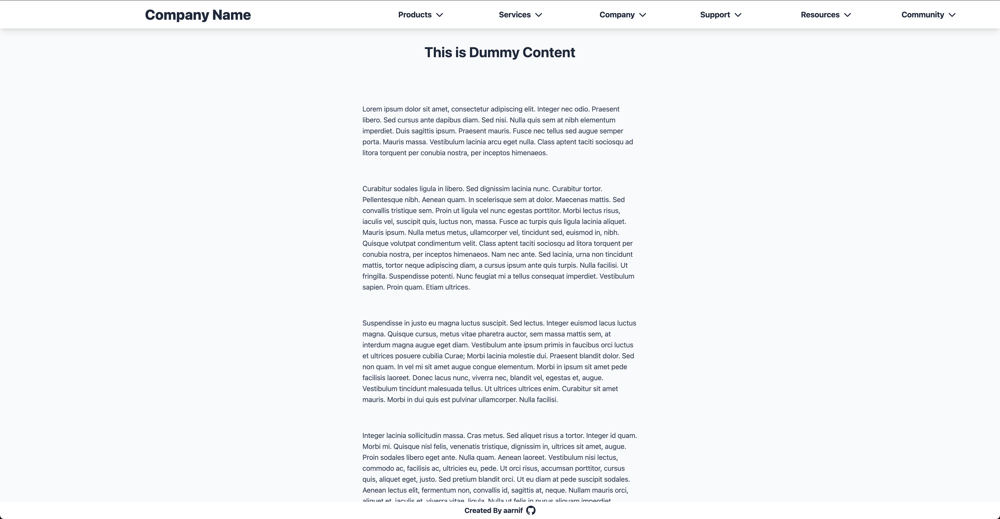

# Drop-Down Menu

This is a drop-down menu example built with HTML, Tailwind CSS and JavaScript.
The project is part of the [The Odin Project's](https://www.theodinproject.com/) Full Stack JavaScript Course.

## Features

- Hides the menu when the user scrolls down.
- Shows the menu when the user scrolls up.
- Clicking on the menu item shows/hides the drop-down menu.

## Live Preview

[DROP-DOWN MENU](https://aarnif.github.io/odin-drop-down-menu/)

## Technologies

- HTML
- Tailwind CSS
- JavaScript
- Midjourney (weather background images)

## Image


Image of the home page.

## Instructions

```
HTTPS - git clone https://github.com/aarnif/odin-drop-down-menu.git

SSH - git clone git@github.com:aarnif/odin-drop-down-menu.git

cd odin-drop-down-menu

npm install

npm run dev # For development

npm run build # For production
```
